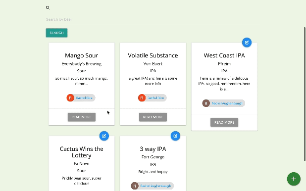
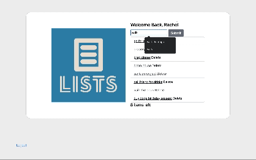

  
  
  
  <!--- 
   -->

Hi, I'm Rachel Rice. A full stack software engineer with a passion for finding solutions to complex problems.

Feel free to email at [RachelRiceDev@gmail.com](mailto:rachelricedev@gmail.com) or visit [my website](https://rachelrice.netlify.app/) for more information! 

---

<h1 align="center">Projects</h1>
<table bordercolor="white">
  
  <tr>
    <td width="50%" valign="top">
      <h3 align="center">The Brew Review</h3>
         
        
         
        

          
    
  <!--  -->
      

        
<strong>Javascript, Materialize, Handlebars, Node.js, & Express.js</strong> - Platform to write and share reviews of your favorie beer! Read what others think about your favorite beer!

    </td>
    <td width="50%" valign="top">
      <h3 align="center">PDX Astronomers</h3>
         
      
         
        

          
  
  
  </a>
      

        
<strong>HTML, CSS, & Javascript</strong> - PDX Astronomers present the NASA Astronomy Picture of the day. Get todays picture or go back through the years to look at previous pictures of the day!

    </td>
  </tr>
  
  <tr>
    <td width="50%" valign="top">
      <h3 align="center">Rachel Rice</h3>
       
        
       
        

  
  
      

        
<strong>HTML5, CSS3, & Javascript</strong> - Portfolio Site including links to my projects and ways to get in contact with me.

    </td>
    <td width="50%" valign="top">
      <h3 align="center">Lists</h3>
         
        
         
        

          
  
  
      

        
<strong>HTML5, CSS3, Javascript, Node.js,Express & Bootstrap</strong> - App to create lists. Users sign up/sign in to create their lists. Items can be marked as done and deleted.

    </td>
  </tr>
</table>

---

<h1 align="center">Languages & Tools</h1>

    
    
    
    
    
     
     
    
    
    
    
    

---

<h1 align="center">Connect</h1>

  
  
  
  <!--- 
   -->

